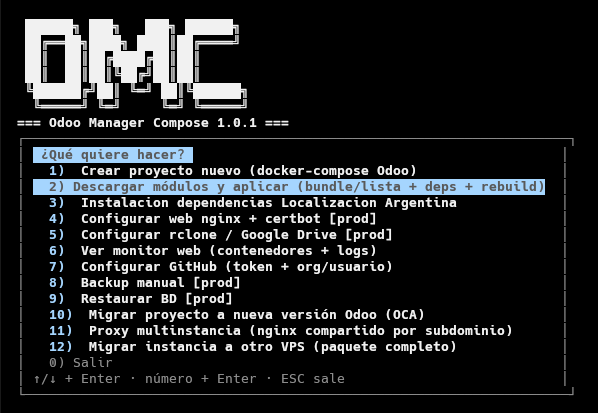

# Odoo Manager Compose (`omc`)

Crea, opera y migra instancias **Odoo 17 / 18 / 19** con docker-compose.
Asistente interactivo + CLI + monitor web + migración OCA entre versiones.

> Documentación completa en [Manual-OMC.md](Manual-OMC.md).

## Qué hace

- **Crear proyectos**: genera `docker-compose.yml` (Odoo + PostgreSQL, + nginx/certbot
  con dominio en prod), `.env`, `config/odoo.conf`, scripts de backup/restore.
  Entornos **dev** (debug, sin restart) y **prod** (workers, tuning PG, límites,
  backups a Google Drive vía rclone).
- **Módulos (`omc addons`)**: descarga **solo los módulos elegidos** de grandes
  monorepos con `git sparse-checkout` (OCA, AdHoc, Cybrosys, Odoo Mates, Codize,
  repos propios o privados). Bundle exportable para clonar instancias,
  resolución de dependencias (`deps`), `sync`, `pull`, `status`, `check-deps`.
- **Localización Argentina**: bundle AdHoc (factura electrónica + IVA),
  `python3-m2crypto` por apt, `SECLEVEL=1`, cache de pyafipws.
- **Monitor web** (`omc-monitor`): Flask solo-lectura del estado de instancias
  (contenedores, cron, colas, disco, SSL, **AFIP WSAA por BD con alertas 30/7 días**),
  tema claro/oscuro, token de acceso (URL y token solo visibles en la opción 6 del menú).
- **Migración OCA** (`omc migrar`): etapa 1 código (`odoo-module-migrator`,
  clasifica migrado/sin-migrar/custom sin mutar el proyecto), etapa 2 BD
  (OpenUpgrade + `docker-compose.migrate.yml`), con backup previo siempre.
- **Backup/restore**: dump PostgreSQL + filestore, local o Drive (+ copia dominical),
  con doble confirmación al restaurar.
- **Desarrollo (IDE + navegador)**: `.vscode/` para VS Code/VSCodium (settings, launch, tasks, extensiones `anomalyco.opencode`/Python/Ruff/Docker/Odoo), `opencode.json` (`$schema` + `instructions ["AGENTS.md"]`), `AGENTS.md` por proyecto, **My Odoo Webkit** Chrome (model/field/record) y **opencode** CLI/TUI.
- **Multi-instancia**: puertos HTTP y gevent validados y sugeridos libres (`ODOO_PORT`,
  `ODOO_GEVENT_PORT` en dev y en prod), `omc list` / `omc doctor [--fix]`. Con dominio en un solo host: **proxy
  nginx compartido** (`omc proxy init` + `omc web --proxy`), un site por
  subdominio con TLS centralizado.

## Requisitos

Python 3.10+, Git, Docker con plugin compose. Para repos privados en https:
`export GITHUB_TOKEN=...` (por env nunca se guarda; el menú 7 puede guardarlo en `~/.config`, jamás en proyectos).

## Instalación

```bash
pipx install odoo-manager-compose
# o (pip ≥23.1; con pip 22 de Ubuntu 22.04 / Python 3.10: sin --break)
pip install odoo-manager-compose --break-system-packages
omc --version  # abre el menú 1-13
```

Global para root + cualquier usuario (VPS con root y usuario admin Odoo):
`pipx` deja `omc` en `~/.local/bin` (solo lo ve quien instaló); `sudo pip --break`
lo deja en `/usr/local/bin` (lo ven todos, como `rocketdoo`). Para global con `pipx`:

```bash
sudo PIPX_HOME=/opt/pipx PIPX_BIN_DIR=/usr/local/bin pipx install --global odoo-manager-compose
# o sin reinstalar (usa tu pipx actual):
sudo ln -sf ~/.local/bin/omc /usr/local/bin/omc
sudo ln -sf ~/.local/bin/omc-monitor /usr/local/bin/omc-monitor
# o por usuario: pipx ensurepath && exec $SHELL -l
which omc  # debe dar /usr/local/bin/omc desde root y desde admin
```

> Detalle en [Manual-OMC §15](Manual-OMC.md#15-instalación-venv-sin-docker) y [§17 VPS](Manual-OMC.md#17-vps-producción).
> `omc` funciona desde cualquier directorio (`/opt`, `/home`, `/tmp`); los proyectos
> siempre se escriben en `/opt/<nombre>` (`$OMC_PROJECTS`, default `/opt`).

## Uso rápido: el menú básico (1-13, 0 sale)

```bash
omc                 # abre el menú
```



*Flujo habitual: `1` crear → `2` módulos → `3` localizar → `8` backup → `13` dev (VS Code/Codium + My Odoo Webkit + opencode). El menú agrupa por fase (Crear / Publicar / Operar) sin renumerar.*

```bash
# Desarrollo (opcional, recomendado siempre — solo dev; en prod VPS solo con --force para opencode terminal sin IDE)
# VS Code / VSCodium + opencode
codium .  # o code . → .vscode/ + opencode.json ya vienen (Ctrl+Esc split, Ctrl+Shift+Esc nueva)
opencode  # TUI: en terminal integrado instala extensión anomalyco.opencode auto; fallback: Marketplace buscar "OpenCode"
# En VPS (prod): omc dev --proyecto . --force  # solo opencode.json terminal, sin .vscode ni extensión
```

Menú avanzado (subcomandos directos como `omc crear --flags`,
`omc doctor --fix`): ver [Manual-OMC](Manual-OMC.md). Para agentes/CI:
`omc list/doctor --json`, `omc logs/update/test` y `AGENTS.md` + `opencode.json` (instrucciones para agentes).

## Estructura del repo

```text
src/omc/            # paquete (cli, core, tui, github, gitutils, manifest,
                    #          addonsops, addons_cli, compose, flows, migrate, webapp)
src/omc/templates/  # compose dev/prod/migrate, odoo.conf, nginx, Dockerfile, backup/restore, vscode-*.json.tpl, opencode.json.tpl, agents-proyecto.md.tpl
src/omc/versions/   # 17.env (pg15), 18.env / 19.env (pg16)
src/omc/data/       # catálogo de addons, localizaciones, bundle ejemplo
src/omc/monitor/    # monitor Flask solo-lectura (lo sirve `omc-monitor`)
tests/              # suite pytest
requirements*.txt   # runtime
Manual-OMC.md        # documentación completa
CHANGELOG.md         # historial
```

### Dónde vive

Los proyectos se crean en `/opt/<nombre>` (ej. `/opt/mi_proyecto`) por convención Odoo (`/opt/odoo`). Ver `omc crear --salida` para otra ruta.

## Licencia

AGPL-3.0 — ver [LICENSE](LICENSE).
